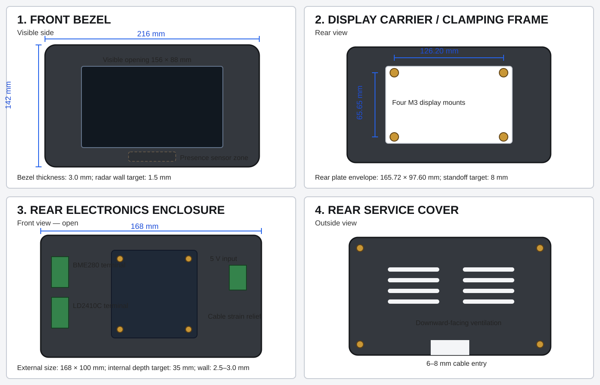

# Dimensioned 3D-Printed Enclosure Specification

## Waveshare ESP32-S3 7-inch Boat Panel — Draft v0.1



This document defines the initial mechanical design for a flush-mounted, 3D-printed enclosure for the Waveshare ESP32-S3 7-inch touchscreen boat panel. It is a parametric prototype specification. Final dimensions must be checked against the physical board and display assembly before cutting the boat panel or producing the final enclosure.

## 1. Enclosure arrangement

The enclosure is divided into four printed parts:

1. Front bezel.
2. Internal display carrier and clamping frame.
3. Rear electronics enclosure.
4. Removable rear service cover.

Additional printed parts:

- LD2410C retaining clip.
- Separate ventilated BME280 sensor pod.

The front glass remains visible on the cabin side. The rear electronics assembly passes through the panel cut-out.

## 2. Baseline display dimensions

| Feature | Dimension |
|---|---:|
| Display assembly width | 192.96 mm |
| Display assembly height | 110.76 mm |
| Active display width | 154.88 mm |
| Active display height | 86.72 mm |
| Rear mounting plate width | 165.72 mm |
| Rear mounting plate height | 97.60 mm |

These values are the working mechanical baseline and must be validated against the physical unit.

## 3. Front bezel

| Feature | Proposed dimension |
|---|---:|
| Overall width | 216 mm |
| Overall height | 142 mm |
| Front thickness | 3.0 mm |
| Outer corner radius | 7 mm |
| Display recess | 194.0 × 111.8 mm |
| Recess depth | 1.5–2.0 mm |
| Visible screen opening | 156.0 × 88.0 mm |
| Presence-sensor zone | approximately 20 mm high |

The bezel should overlap the panel cut-out sufficiently to accommodate a gasket and hidden fixing points.

The LD2410C should sit behind the lower solid section of the bezel. The plastic directly in front of the sensor should be approximately 1.5 mm thick, with no metal fasteners, brass inserts, foil, metallic paint or shielded cable directly in front of it.

## 4. Cabin panel cut-out

Initial cut-out recommendation:

```text
170 mm wide × 102 mm high
Corner radius: 3–5 mm
```

This provides clearance around the approximate 165.72 × 97.60 mm rear plate.

With a 216 × 142 mm bezel, the nominal overlap is:

- 23 mm at each side;
- 20 mm at the top and bottom.

Before cutting the boat panel, print a thin cut-out and mounting template and test it against the actual display.

## 5. Display mounting geometry

Approximate four-hole M3 pattern:

```text
Horizontal spacing: 126.20 mm
Vertical spacing:   65.65 mm
Thread:             M3
```

Approximate centres relative to the top-left of the rear mounting plate:

| Hole | X | Y |
|---|---:|---:|
| Top left | 19.76 mm | 18.31 mm |
| Top right | 145.96 mm | 18.31 mm |
| Bottom left | 19.76 mm | 83.96 mm |
| Bottom right | 145.96 mm | 83.96 mm |

Recommended mounting hardware:

- M3 × 8 or M3 × 10 stainless machine screws;
- printed support pads;
- thin nylon or fibre washers;
- no clamping pressure on the glass.

Recommended printed M3 clearance hole: 3.4 mm.

## 6. Internal display carrier and clamping frame

The carrier should:

- locate the display through the M3 mounting points;
- support the board without pressing on the touchscreen glass;
- provide approximately 8 mm standoff height where required;
- provide six clamping points to the front bezel;
- support cabin-panel thicknesses from approximately 3–18 mm through interchangeable screw lengths.

Recommended clamping arrangement:

- two screws across the top;
- two across the bottom;
- one on each side;
- M3 heat-set inserts in the front bezel or carrier;
- stainless M3 machine screws from the rear.

## 7. Rear electronics enclosure

| Feature | Proposed dimension |
|---|---:|
| Outside width | 168 mm |
| Outside height | 100 mm |
| Internal depth | 35 mm |
| Estimated total rear depth | 39–42 mm |
| Wall thickness | 2.5–3.0 mm |
| Rear-cover thickness | 2.5 mm |

The final depth must be checked around:

- USB-C sockets;
- microSD access;
- Waveshare connectors;
- terminal blocks;
- cable bend radius;
- the display PCB and ribbon cables.

The 12 V-to-5 V converter should remain outside this enclosure to reduce heat and electrical noise.

## 8. Internal layout

The enclosure should be divided into zones:

```text
Display PCB area

Signal wiring zone       5 V input zone
BME280 terminal          Power terminal
Presence sensor terminal Ground terminal

Cable strain-relief area
```

Recommended internal connections:

- four-way pluggable terminal for BME280: 3.3 V, GND, SDA and SCL;
- three-way pluggable terminal for LD2410C: 5 V, GND and OUT;
- two-way terminal for incoming regulated 5 V;
- WAGO 221 or equivalent fixed distribution where practical;
- ferrules on all stranded conductors.

## 9. LD2410C pocket

Proposed internal allowance:

```text
Width:  40 mm
Height: 20 mm
Depth:  11 mm
```

The sensor should be:

- centred horizontally below the display;
- approximately 8–12 mm below the display glass;
- parallel to the bezel front;
- held by a removable printed clip rather than permanent adhesive;
- initially configured for approximately 1.5–2 m detection range.

The pocket and clip should allow access for configuration and replacement.

## 10. BME280 sensor pod

The BME280 must not be mounted inside the warm display enclosure.

Proposed pod dimensions:

| Feature | Dimension |
|---|---:|
| Outside width | 34 mm |
| Outside height | 34 mm |
| Outside depth | 15 mm |
| Internal sensor pocket | 21 × 21 × 7 mm |
| Wall thickness | 2 mm |
| Vent slot width | 1.5–2 mm |

The pod should have:

- a vented front shell;
- removable rear plate;
- side and lower ventilation slots;
- no upward-facing openings where condensation could drip inside;
- a four-core cable carrying 3.3 V, GND, SDA and SCL;
- a removable tray or edge clips for the breakout board.

Recommended mounting distance from the display electronics: 10–30 cm.

## 11. Gasket

Provide a closed-loop gasket groove behind the front bezel.

Initial groove:

```text
Width: 3.0 mm
Depth: 1.0–1.2 mm
```

Use 2–3 mm closed-cell neoprene or EPDM foam.

The gasket is intended to:

- reduce rattling;
- accommodate a slightly uneven cabin panel;
- reduce incidental splash and condensation ingress.

The assembly should not be described as waterproof unless it is tested.

## 12. Rear service cover

The rear cover should use four M3 screws into heat-set inserts.

Include:

- downward-facing ventilation slots;
- a 6–8 mm cable-entry recess;
- an internal strain-relief anchor;
- access to the microSD card where practical;
- labels for 5 V, GND, BME280 and presence connections.

Suggested ventilation pattern:

```text
Six slots per ventilation group
Slot size: approximately 20 × 2 mm
Minimum spacing: 3 mm
```

## 13. Cable routing

### Power cable

- regulated 5 V and GND only;
- 6–8 mm enclosure opening depending on cable;
- clamp the outer insulation inside the enclosure.

### BME280 cable

- four-core cable;
- 4–6 mm enclosure opening;
- keep the run short where practical;
- route away from noisy power wiring.

## 14. Material and printing

Preferred materials:

- PETG for an internal cabin installation;
- ASA where the panel is exposed to significant heat or sunlight;
- PLA only for prototypes and fitting gauges.

Initial print settings:

```text
Layer height:       0.20 mm
Perimeters:         4
Top/bottom layers:  5
Infill:             25–35%
Insert bosses:      locally solid or 80–100%
Nozzle:             0.4 mm
```

Suggested orientation:

- bezel visible face down on a clean plate where feasible;
- rear box back down;
- service cover flat;
- BME280 pod rear face down;
- heat-set insert bosses vertical where possible.

## 15. Starting tolerances

| Interface | Starting clearance |
|---|---:|
| Display glass in recess | 0.5 mm per side |
| Rear box in panel cut-out | 1.0–2.0 mm per side |
| Removable cover | 0.3–0.5 mm per side |
| Presence-sensor clip | 0.25–0.4 mm |
| M3 clearance hole | 3.4 mm |
| M2.5 clearance hole | 2.9 mm |
| Cable-channel allowance | at least 1 mm extra |

These values must be adjusted for the chosen printer, material and dimensional calibration.

## 16. Parametric CAD baseline

```text
DISPLAY_GLASS_W        = 192.96
DISPLAY_GLASS_H        = 110.76
ACTIVE_DISPLAY_W       = 154.88
ACTIVE_DISPLAY_H       = 86.72

FRONT_BEZEL_W          = 216
FRONT_BEZEL_H          = 142
DISPLAY_RECESS_W       = 194.0
DISPLAY_RECESS_H       = 111.8
VISIBLE_OPENING_W      = 156.0
VISIBLE_OPENING_H      = 88.0

PANEL_CUTOUT_W         = 170
PANEL_CUTOUT_H         = 102

REAR_BOX_W             = 168
REAR_BOX_H             = 100
REAR_INTERNAL_DEPTH    = 35

RADAR_WINDOW_THICKNESS = 1.5
```

## 17. Prototype sequence

### Prototype A — dimension gauge

Print a 2 mm plate containing:

- the display recess;
- visible-screen opening;
- M3 mounting pattern;
- panel cut-out outline.

### Prototype B — bezel corner

Verify:

- glass recess depth;
- corner radius;
- gasket groove;
- visible-screen overlap.

### Prototype C — presence-sensor section

Print the lower bezel section and test LD2410C operation through the 1.5 mm wall.

### Prototype D — complete assembly

Print the full bezel, carrier, rear enclosure and cover only after the earlier gauges fit correctly.

## 18. Open verification points

- Confirm exact Waveshare PCB revision.
- Measure the physical display assembly with callipers.
- Confirm rear depth and all connector projections.
- Confirm M3 mounting-hole locations.
- Confirm LD2410C module dimensions and OUT voltage.
- Confirm the BME280 breakout selected for purchase.
- Confirm cabin-panel thickness and available rear clearance.
- Measure operating temperature and power consumption in the prototype enclosure.
